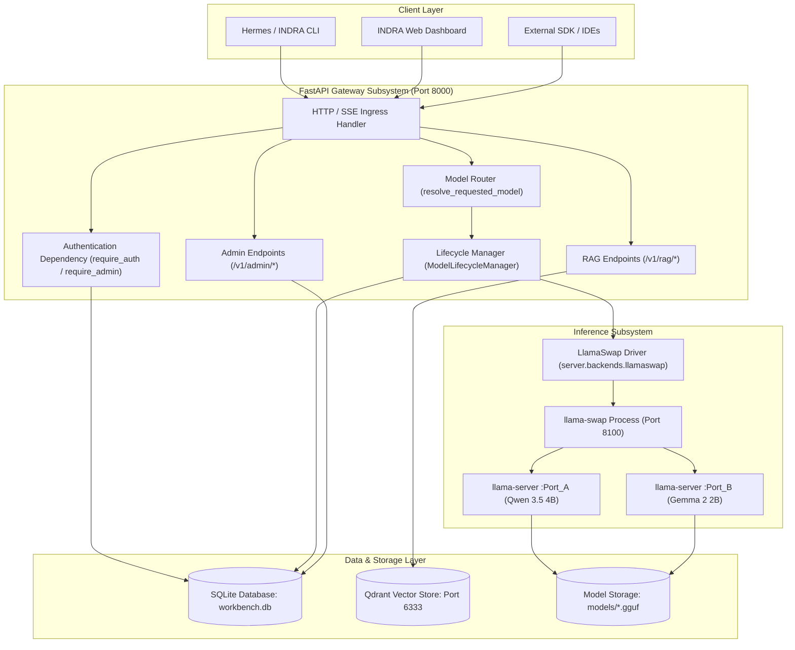
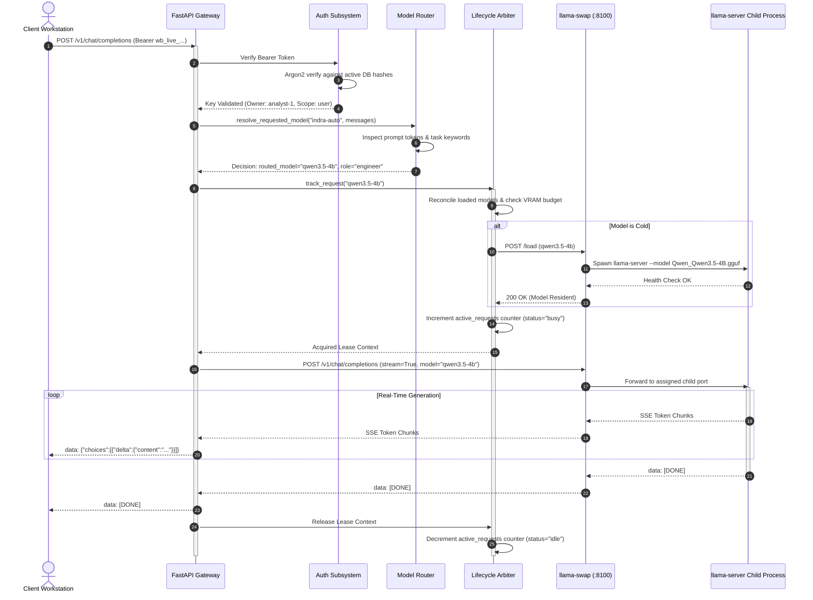
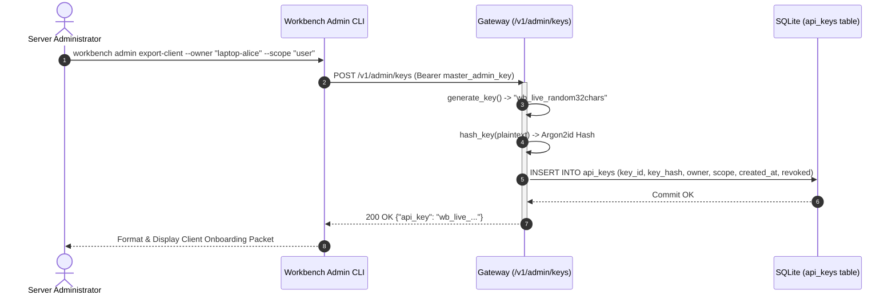
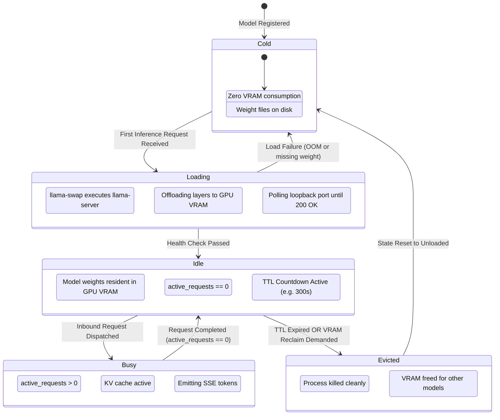
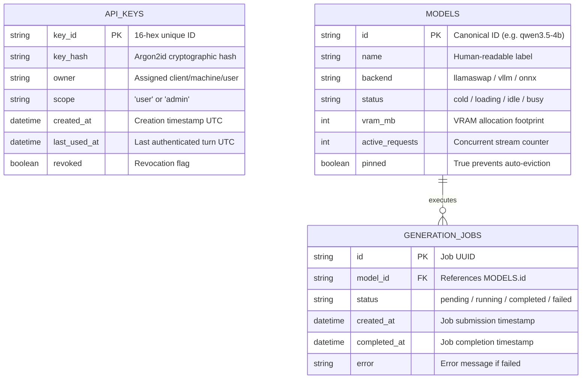

# Architecture & UML Specifications

This document defines the formal software architecture, data models, sequence flows, and state machines for the **Summertime AI Workbench Server**.

---

## 1. High-Level Component Diagram

---

## 2. End-to-End Inference Sequence Diagram

The following sequence illustrates a client requesting an inferencing stream (`POST /v1/chat/completions` with `stream=True` and `model="indra-auto"`).

---

## 3. Dynamic API Key Issuance Sequence Diagram

---

## 4. Model Lifecycle State Machine

---

## 5. Entity-Relationship Diagram (ERD)

