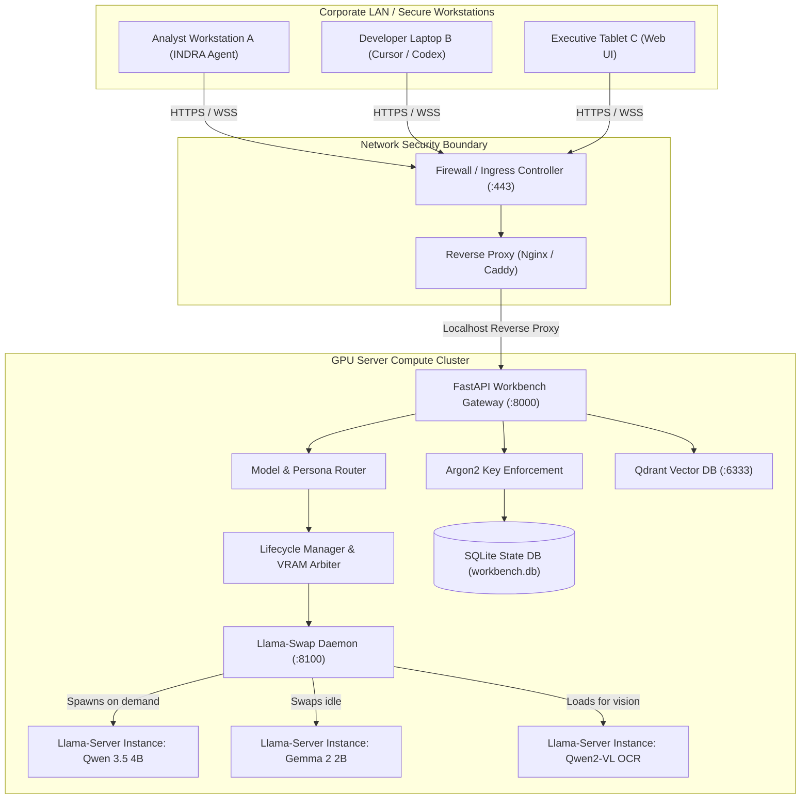
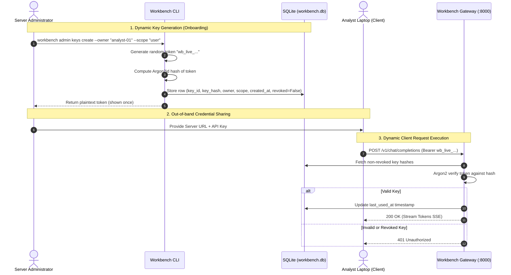
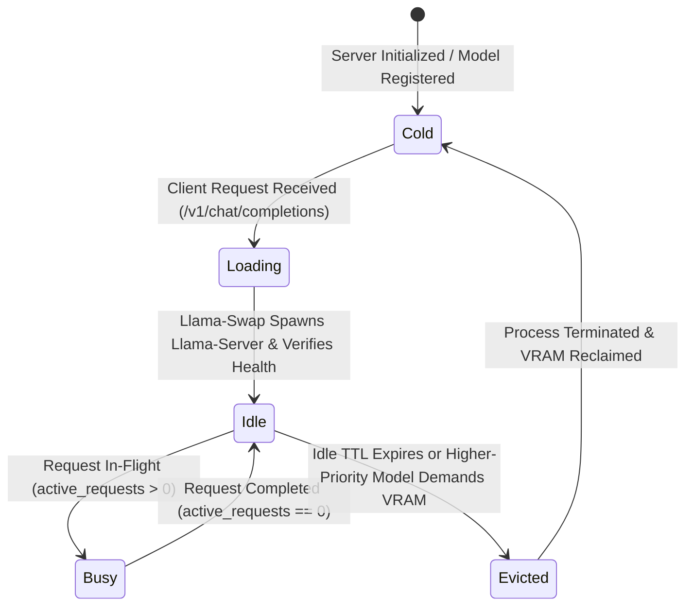
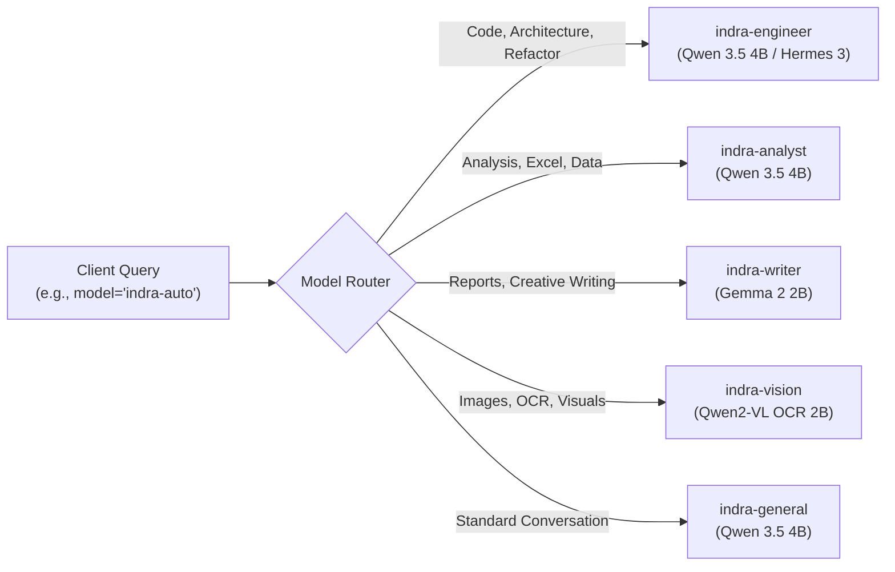

# Distributed Architecture & Production Deployment Guide

## 1. Architectural Philosophy & Sovereign Decoupling

Modern enterprise AI deployments face a fundamental friction:
- **Analyst Workstations** (laptops, edge devices, virtual desktops) require rapid, interactive agentic workflows, office document synthesis, voice interaction, and local note taking, but **lack the 24GB+ VRAM** needed to host high-parameter reasoning models.
- **Centralized Cloud AI** exposes proprietary corporate data, intellectual property, and internal records to external third-party infrastructure.

**Summertime AI Workbench Server** solves this by establishing a **Sovereign Client-Server Architecture**:
1. The **Server** resides in your secure on-premises datacenter, private VPC, or dedicated GPU node, maintaining all heavy model weights, GPU context buffers, and vector embeddings behind your corporate firewall.
2. The **Clients** (such as INDRA Desktop or Hermes Agent) run locally on analyst workstations with zero local model footprint, issuing authenticated OpenAI-compatible requests to the server.



---

## 2. Network Topology & Port Allocations

| Component | Default Port | Exposure | Protocol | Description |
| :--- | :--- | :--- | :--- | :--- |
| **Workbench Gateway** | `8000` | LAN / Ingress Proxy | HTTP / HTTPS (REST + SSE) | Primary public API surface for client inference, models, and admin. |
| **Llama-Swap Daemon** | `8100` | `127.0.0.1` ONLY | HTTP (Private loopback) | Internal model process supervisor and port proxy. **Never expose to external network.** |
| **Llama-Server Children** | `Dynamic` | `127.0.0.1` ONLY | HTTP (Loopback) | Ephemeral inference servers spawned by llama-swap on ephemeral ports. |
| **Qdrant Vector DB** | `6333` | LAN / Localhost | HTTP / gRPC | Vector search and collection indexing for enterprise RAG. |

### Firewall Rule Recommendations (Linux `ufw` or `firewalld`)
```bash
# Allow inbound HTTPS/HTTP on API port from corporate subnet only:
sudo ufw allow from 192.168.1.0/24 to any port 8000 proto tcp comment 'Workbench Gateway'

# Strictly block direct external access to internal ports:
sudo ufw deny 8100
sudo ufw deny 6333
```

---

## 3. Hardware Acceleration, CUDA Drivers & Engine DLL Matrix

Different deployment hosts feature widely disparate hardware architectures (Windows workstations with RTX GPUs, headless Linux servers with A100/H100 clusters, AMD/Intel systems, or CPU-only VMs). Summertime AI Workbench provides specialized engine backends for each environment.

### Hardware Acceleration Compatibility Matrix

| Host Environment | Recommended Engine | Required CUDA / System Libraries | Setup & Verification Steps |
| :--- | :--- | :--- | :--- |
| **Windows 10/11 (NVIDIA RTX 30/40/50 Series)** | **Llama-Swap (llama-server.exe)** | • NVIDIA Driver >= 535.xx<br>• `cudart64_12.dll`<br>• `cublas64_12.dll`<br>• `cublasLt64_12.dll`<br>• `libomp.dll`<br>• `ggml-cuda.dll` | Place DLLs into `bin/` directory.<br>In PowerShell: `$env:PATH = "$PSScriptRoot\bin;$env:PATH"`.<br>Run `nvidia-smi` to verify driver. |
| **Linux (Ubuntu 22.04 / RHEL 9 with NVIDIA GPUs)** | **vLLM** OR **Llama-Swap** | • NVIDIA Driver >= 535.xx<br>• CUDA Toolkit 12.1+ / 12.4+<br>• `libcudart.so.12`<br>• `libcublas.so.12` | Install CUDA via `apt install nvidia-cuda-toolkit`.<br>Set `export LD_LIBRARY_PATH=/usr/local/cuda/lib64:$LD_LIBRARY_PATH`.<br>Verify with `nvidia-smi` and `nvcc --version`. |
| **Windows PC (AMD Radeon / Intel Arc)** | **Llama-Swap (Vulkan)** | • Latest AMD Adrenalin / Intel Arc drivers<br>• `vulkan-1.dll`<br>• `ggml-vulkan.dll` | Bundled in `llama-vulkan` runtime package. Offloads layers directly via Vulkan SPIR-V compute. |
| **Windows / Linux (CPU-Only / VM)** | **Llama-Swap (CPU AVX2)** | • Modern x86-64 CPU with AVX/AVX2/AVX-512<br>• `libomp.dll` / `libgomp.so` | Automatic fallback to `ggml-cpu-haswell` or `ggml-cpu-alderlake` binaries. Set `--threads <NUM_CORES>`. |
| **Windows Host wanting vLLM** | **vLLM via WSL2 or Docker** | • Windows 10 build 19044+ or Windows 11<br>• WSL2 with Ubuntu 22.04 LTS<br>• NVIDIA Container Toolkit | **Note**: vLLM has no official native Windows support.<br>Run vLLM inside WSL2 with GPU passthrough or via Docker with `--gpus all`. |

---

### Step-by-Step Machine Setup Configurations

#### Configuration A: Windows Server / Workstation with NVIDIA GPU
1. **Download & Place CUDA Runtime DLLs**:
   Ensure `bin/` contains the following DLL files from CUDA 12.x:
   - `cublas64_12.dll`
   - `cublasLt64_12.dll`
   - `cudart64_12.dll`
   - `libomp.dll`
   - `ggml-cuda.dll`
2. **Add `bin` to Environment PATH**:
   `start-backend.ps1` automatically prepends `$backendDir\bin` to `$env:PATH` upon execution.
   If running manually:
   ```powershell
   $env:PATH = "$PWD\bin;$env:PATH"
   ```
3. **Audio Transcription & TTS Dependency**:
   Offline speech recognition (`faster-whisper` / `ctranslate2`) dynamically links against `cublas64_12.dll` and `cudart64_12.dll`. Keeping these in `bin/` satisfies both LLM inference and local audio services.

#### Configuration B: Dedicated Enterprise Linux GPU Server (RunPod, Lambda, AWS EC2, On-Prem)
1. **Verify GPU Driver & CUDA**:
   ```bash
   nvidia-smi
   nvcc --version
   ```
2. **Launch with Native vLLM or Llama-Swap**:
   - For **Llama-Swap**: Place Linux `bin/llama-swap` and compile/place `llama-server`.
   - For **vLLM**: Install via pip: `pip install vllm`. Set `backend: vllm` in `config/config.yaml`.
   vLLM requires NVIDIA Compute Capability >= 7.0 (Turing, Ampere, Ada Lovelace, Hopper, Blackwell).

#### Configuration C: Windows without NVIDIA GPU (Vulkan / CPU)
1. Set `auto-configure-models.py` to offload via Vulkan or reduce `--n-gpu-layers 0` for pure CPU multi-threading.
2. In `config/llama-swap.yaml`, point `--threads` to the physical CPU core count (e.g. `--threads 8`).

---

## 4. Cryptographic Authentication & Key Lifecycle

Summertime completely rejects hardcoded API tokens. Every key is dynamically generated, cryptographically hashed using **Argon2id**, and authenticated per request with zero external network overhead.

### Key Lifecycle Sequence Diagram



### Key Scopes & Permissions

| Scope | Allowed Endpoints | Description |
| :--- | :--- | :--- |
| `user` | `/v1/chat/completions`, `/v1/models`, `/v1/embeddings`, `/v1/rag/*`, `/v1/health` | Standard client access for inference, streaming, and RAG retrieval. |
| `admin` | All `user` endpoints + `POST /v1/admin/keys`, `GET /v1/admin/keys`, `DELETE /v1/admin/keys/{id}`, `/v1/models/sync` | Superuser administrative operations and key issuance. |

---

## 5. Model Lifecycle & VRAM Arbiter

To allow multi-model AI suites to run on moderate hardware (e.g., 6GB–16GB VRAM), the server implements a dynamic lifecycle state machine coordinated between FastAPI and `llama-swap`.



### Key Technical Safeguards:
1. **Reconciliation on Startup**: Stale `active_requests` counters left behind by abnormal server terminations are cleared automatically on reboot, preventing permanent model freezes.
2. **Double-Budget Prevention**: Llama-swap manages its own resident memory; the Workbench lifecycle manager reconciles resident models before calculating budget rather than blindly trying to evict them.
3. **Graceful Timeouts**: Models are held in memory for their configured TTL (e.g., 300s) to deliver instant zero-latency responses to continuous follow-up turns.

---

## 6. Intelligent Model Routing

Clients do not need to know the exact GGUF filename or quantization parameters. Instead, clients query standardized **role aliases**:



The router injects headers in the HTTP response so clients know which physical model served their turn:
- `X-Workbench-Requested-Model: indra-auto`
- `X-Workbench-Routed-Model: qwen3.5-4b`
- `X-Workbench-Route: engineer`

---

## 7. Production Linux Systemd Deployment

In an enterprise Linux environment (Ubuntu 22.04 LTS / RHEL 9), deploy the server as managed systemd service units.

### Service Unit: `/etc/systemd/system/summertime.service`
```ini
[Unit]
Description=Summertime AI Workbench Server Gateway
After=network.target

[Service]
Type=simple
User=ai-service
Group=ai-service
WorkingDirectory=/opt/summertime-server
EnvironmentFile=/opt/summertime-server/.env
ExecStart=/opt/summertime-server/venv/bin/uvicorn server.app:app --host 0.0.0.0 --port 8000 --workers 2
Restart=always
RestartSec=5
LimitNOFILE=65536

[Install]
WantedBy=multi-user.target
```

### Enabling and Starting the Service
```bash
sudo systemctl daemon-reload
sudo systemctl enable --now summertime
sudo systemctl status summertime
```

---

## 8. Nginx Reverse Proxy with TLS Termination

Exposing port 8000 directly across a corporate WAN is not recommended. Use Nginx with TLS (HTTPS) and WebSocket/SSE streaming support:

```nginx
server {
    listen 443 ssl http2;
    server_name ai-gateway.internal.enterprise.com;

    ssl_certificate     /etc/ssl/certs/ai-gateway.crt;
    ssl_certificate_key /etc/ssl/private/ai-gateway.key;
    ssl_protocols       TLSv1.2 TLSv1.3;

    client_max_body_size 100M;

    location / {
        proxy_pass http://127.0.0.1:8000;
        proxy_http_version 1.1;
        
        # Mandatory for SSE streaming (disables buffering):
        proxy_set_header Connection '';
        proxy_buffering off;
        proxy_cache off;
        chunked_transfer_encoding on;

        proxy_set_header Host $host;
        proxy_set_header X-Real-IP $remote_addr;
        proxy_set_header X-Forwarded-For $proxy_add_x_forwarded_for;
        proxy_set_header X-Forwarded-Proto $scheme;

        # Keep alive timeouts for long reasoning turns:
        proxy_read_timeout 600s;
        proxy_send_timeout 600s;
    }
}
```

---

## 9. Database Schema & Data Dictionary

Summertime persists system state in an embedded SQLite database (`workbench.db`) using SQLAlchemy ORM.

### Table: `api_keys`
| Column | Type | Constraints | Description |
| :--- | :--- | :--- | :--- |
| `key_id` | `VARCHAR(16)` | Primary Key | Public identifier used for logging and key revocation. |
| `key_hash` | `VARCHAR(255)` | Not Null | Cryptographic Argon2id hash of the plaintext bearer key. |
| `owner` | `VARCHAR(100)` | Not Null | Identifier of the assigned workstation, user, or service. |
| `scope` | `VARCHAR(20)` | Default `'user'` | Access authorization scope (`user` or `admin`). |
| `created_at` | `DATETIME` | Not Null | UTC timestamp when the key was provisioned. |
| `last_used_at` | `DATETIME` | Nullable | UTC timestamp of the most recent authenticated API request. |
| `revoked` | `BOOLEAN` | Default `False` | True if the key has been invalidated. |

### Table: `models`
| Column | Type | Constraints | Description |
| :--- | :--- | :--- | :--- |
| `id` | `VARCHAR(100)` | Primary Key | Canonical model identifier (e.g. `qwen3.5-4b`). |
| `name` | `VARCHAR(100)` | Not Null | Display name of the model. |
| `backend` | `VARCHAR(50)` | Default `'llamaswap'` | Execution engine (`llamaswap`, `vllm`, `onnx`). |
| `status` | `VARCHAR(20)` | Default `'cold'` | Lifecycle state: `cold`, `loading`, `idle`, `busy`. |
| `vram_mb` | `INTEGER` | Default `0` | Estimated VRAM footprint required when resident. |
| `active_requests`| `INTEGER` | Default `0` | Number of concurrent inference streams actively using the model. |
| `pinned` | `BOOLEAN` | Default `False` | If True, the arbiter will never evict this model for memory. |

---

## 10. Troubleshooting & Diagnostics

| Symptom | Primary Cause | Resolution |
| :--- | :--- | :--- |
| **`401 Unauthorized`** | Client key missing, expired, or invalid Argon2 match. | Generate a new key via `workbench admin keys create` and update client `.env`. |
| **`403 Forbidden`** | Non-admin key attempted to access administrative routes. | Check key scope; use an `admin` scoped key for `/v1/admin/*` and `/v1/models/sync`. |
| **Model stuck in `busy`** | Gateway terminated abruptly while a request was running. | Restart the gateway or run `python -m server.cli.main status`; startup reconciliation will clear stale counters. |
| **`504 Gateway Timeout`** | Model load from disk took longer than client timeout. | Pre-warm model by sending a dummy prompt, or configure `llama-swap.yaml` with longer `healthCheckTimeout: 180`. |
| **Streaming stops abruptly** | Nginx reverse proxy buffering SSE tokens. | Ensure `proxy_buffering off;` and `chunked_transfer_encoding on;` are configured in Nginx. |
