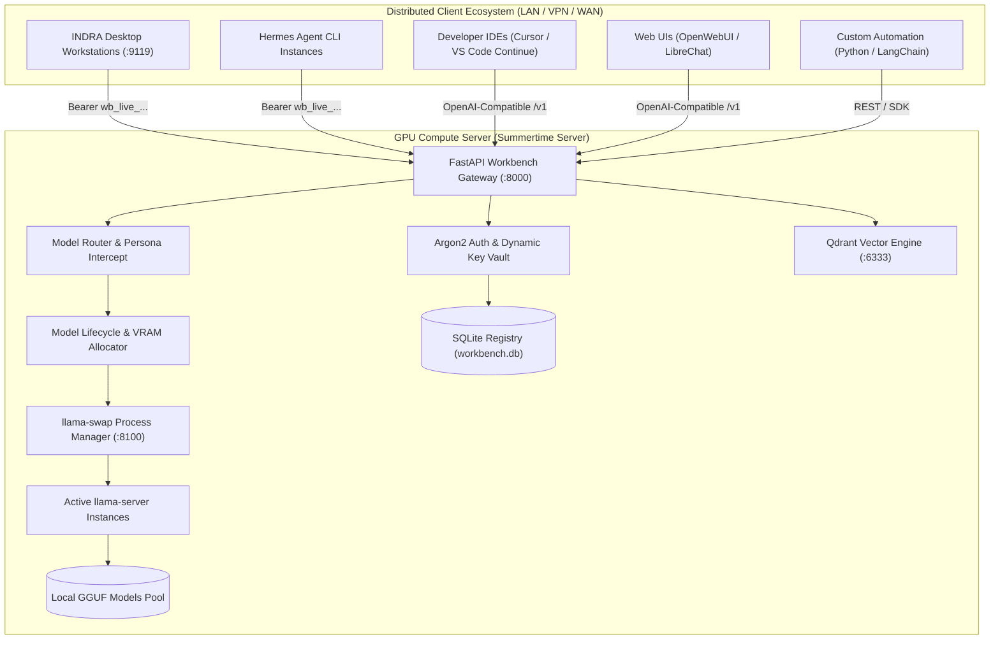

# Summertime AI Workbench Server

[](LICENSE)
[](https://fastapi.tiangolo.com)
[](https://platform.openai.com/docs/api-reference)
[](#)

**Summertime AI Workbench Server** is an enterprise-grade, high-performance local AI model serving gateway and dynamic orchestration platform. Designed specifically for **distributed enterprise environments**, it decouples heavy GPU model inference from analyst workstations, allowing lightweight client devices (INDRA Desktop, Hermes Agent, IDEs, Web UIs) to seamlessly connect to a centralized, sovereign AI compute pool.

---

## 🌟 Key Features

- **Decoupled Distributed Architecture**: Host models centrally on a GPU cluster/server; distribute client agent access across team laptops without copying heavy weights.
- **Dynamic API Key Provisioning**: Zero hardcoded credentials. Administrators issue and revoke scoped API keys on-demand with Argon2 cryptographic hashing.
- **Automated VRAM & Model Hot-Swapping**: Integrates `llama-swap` to dynamically load, swap, and evict models in seconds based on client requests, fitting multi-model pipelines into constrained VRAM.
- **Intelligent Role-Based Routing**: Clients query high-level aliases (`indra-auto`, `indra-engineer`, `indra-analyst`, `indra-vision`, `indra-writer`); the server inspects the prompt and routes to the optimal physical GGUF.
- **Full OpenAI-Compatible REST API**: Drop-in replacement for OpenAI endpoints (`/v1/chat/completions`, `/v1/models`, `/v1/embeddings`), supporting Server-Sent Events (SSE) streaming and tool calling.
- **Enterprise Vector RAG Service**: Built-in Qdrant vector database integration for team-wide document indexing and hybrid retrieval.
- **Air-Gapped & Sovereign**: Zero outbound telemetry or cloud egress. All processing remains on your private network.

---

## 📐 Distributed System Topology



---

## 🚀 Quickstart (Server Setup)

### 1. Prerequisites
- **OS**: Linux (Ubuntu 22.04+, RHEL 9+) or Windows 10/11 / Windows Server 2022.
- **Hardware**: NVIDIA GPU with CUDA drivers (or Apple Silicon / CPU fallback).
- **Python**: 3.10, 3.11, or 3.12.

### 2. Installation
```bash
# Clone the repository
git clone https://github.com/Artyfowl1710/Summertime-server.git
cd Summertime-server

# Create virtual environment
python -m venv venv
source venv/bin/activate  # Windows: .\venv\Scripts\activate

# Install dependencies
pip install -r requirements.txt
```

### 3. Add Models & Auto-Configure
Place your GGUF model files into the `models/` directory:
```bash
mkdir -p models
# Copy your .gguf models into models/
```

Run the automatic model profiler to generate the optimal `llama-swap.yaml` configuration tuned for your GPU:
```bash
python auto-configure-models.py
python register_models.py
```

### 4. Configure Environment & Bootstrap Admin Key
```bash
cp .env.example .env
```
Bootstrap the initial superuser administrative key:
```bash
python -m server.cli.main admin bootstrap
```
*Note the generated `wb_live_...` key and set it as `WORKBENCH_API_KEY` in your `.env`.*

### 5. Launch the Server
```bash
# Using Python directly
uvicorn server.app:app --host 0.0.0.0 --port 8000

# OR on Windows using the PowerShell starter
.\start-backend.ps1
```

The server is now live and accepting connections on port `8000`!

---

## 🔑 Dynamic Client Key Issuance

To onboard a new client workstation without hardcoding or sharing master credentials:

```bash
# Generate a scoped client key and complete onboarding packet:
python -m server.cli.main admin export-client --owner "analyst-laptop-01" --server-url "http://192.168.1.100:8000" --scope "user"
```

This outputs a dynamic provisioning packet:
```text
=================================================================
DYNAMIC CLIENT ONBOARDING PACKET FOR: analyst-laptop-01
=================================================================
Generated Key (shown once): wb_live_9f82a1b7c3d4e5f6a7b8c9d0e1f2a3b4
Server Base URL:            http://192.168.1.100:8000

1. Single-Command Client Pairing (INDRA / Hermes CLI):
  indra set-server --url http://192.168.1.100:8000 --key wb_live_9f82a1b7c3d4e5f6a7b8c9d0e1f2a3b4

2. Client .env Configuration Block:
  WORKBENCH_API_BASE=http://192.168.1.100:8000
  WORKBENCH_API_KEY=wb_live_9f82a1b7c3d4e5f6a7b8c9d0e1f2a3b4
  OPENAI_API_KEY=wb_live_9f82a1b7c3d4e5f6a7b8c9d0e1f2a3b4
  OPENAI_BASE_URL=http://192.168.1.100:8000/v1
=================================================================
```

---

## ⚡ 1-Click GPU Context Window Switching (Eco / Balanced / Power / Ultra)

Summertime Server provides hot-swapping of model context windows (`-c <tokens>`) to match the host machine's VRAM without blocking inference or requiring manual YAML reconfiguration:

| Preset | Context Length | Target Hardware | Typical Use Case |
|---|---|---|---|
| **`eco`** | 4,096 tokens (4K) | 6GB - 8GB VRAM (e.g. RTX 3060/4060) | Low memory footprint, fast single-prompt generation |
| **`balanced`** | 16,384 tokens (16K) | 12GB - 16GB VRAM (e.g. RTX 3080/4070) | Default recommended setting for general code and RAG |
| **`power`** | 32,768 tokens (32K) | 24GB VRAM (e.g. RTX 3090/4090/A5000) | Deep reasoning, large codebase analysis, multi-file inspection |
| **`ultra`** | 65,536 tokens (64K) | 48GB - 80GB VRAM (e.g. A6000/A100/H100) | Enterprise repository-wide architecture and massive document digests |

### 1. Change Context via CLI
```bash
# Set context by hardware preset:
python -m server.cli.main admin set-context eco
python -m server.cli.main admin set-context balanced
python -m server.cli.main admin set-context power
python -m server.cli.main admin set-context ultra

# Or specify custom token length:
python auto-configure-models.py --ctx 8192
```

### 2. Change Context Remotely via REST API
Clients (like the INDRA Desktop Dashboard) can dynamically adjust the server's context window on-the-fly:
```bash
curl -X POST http://192.168.1.100:8000/v1/admin/context \
  -H "Authorization: Bearer wb_live_YOUR_KEY" \
  -H "Content-Type: application/json" \
  -d '{"preset": "power"}'
```

---

## 🧪 Comprehensive Health Verification

Run the built-in end-to-end verification suite anytime to confirm your server is operating at 100%:
```bash
python test_server_connectivity.py --url http://127.0.0.1:8000 --key wb_live_YOUR_KEY
```

**Verification checks performed:**
1. Public health check (`/v1/health`)
2. Authenticated model discovery (`/v1/models`)
3. Non-streaming inference completion (`/v1/chat/completions`)
4. Real-time token streaming via Server-Sent Events (SSE)
5. Persona identity contract enforcement

---

## 🔌 Connecting Diverse Clients

### 1. INDRA Desktop / Hermes Agent
On the client machine, run:
```bash
indra set-server --url http://192.168.1.100:8000 --key wb_live_...
```

### 2. Official OpenAI Python SDK
```python
from openai import OpenAI

client = OpenAI(
    base_url="http://192.168.1.100:8000/v1",
    api_key="wb_live_your_key_here",
)

response = client.chat.completions.create(
    model="indra-auto",
    messages=[{"role": "user", "content": "Explain Zero-Trust Architecture in 3 points."}],
    stream=True,
)

for chunk in response:
    print(chunk.choices[0].delta.content or "", end="", flush=True)
```

### 3. Cursor / VS Code Continue Plugin
In `~/.continue/config.json`:
```json
{
  "models": [
    {
      "title": "Summertime AI (Remote)",
      "provider": "openai",
      "model": "indra-engineer",
      "apiBase": "http://192.168.1.100:8000/v1",
      "apiKey": "wb_live_your_key_here"
    }
  ]
}
```

---

## 📚 In-Depth Guides

- [Distributed Architecture & Deployment Guide](DISTRIBUTED_ARCHITECTURE_AND_DEPLOYMENT.md): High availability, reverse proxies, systemd services, VRAM budgeting math, and database schemas.
- [Client Onboarding & Integration Guide](CLIENT_ONBOARDING_GUIDE.md): Connecting LangChain, LlamaIndex, Web UIs, and troubleshooting connection errors.
- [Architecture & UML Specifications](ARCHITECTURE_AND_UML.md): Sequence diagrams, component models, and lifecycle state machines.

---

## 📄 License
Released under the [MIT License](LICENSE).
